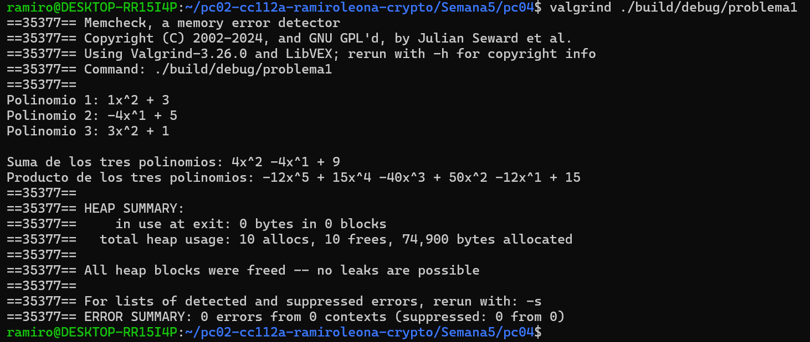
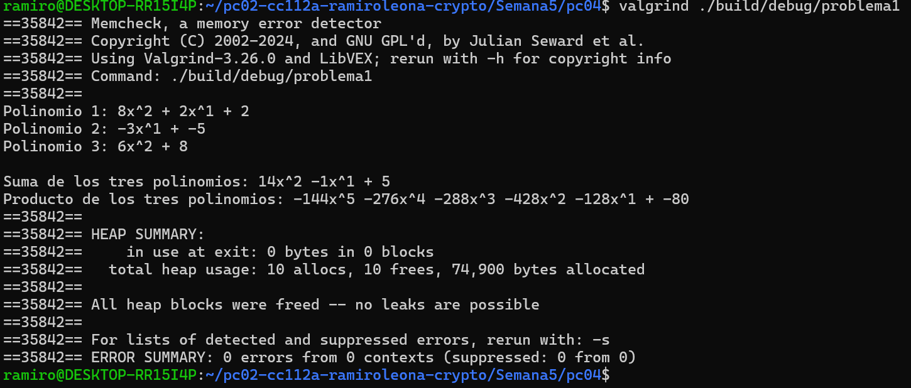
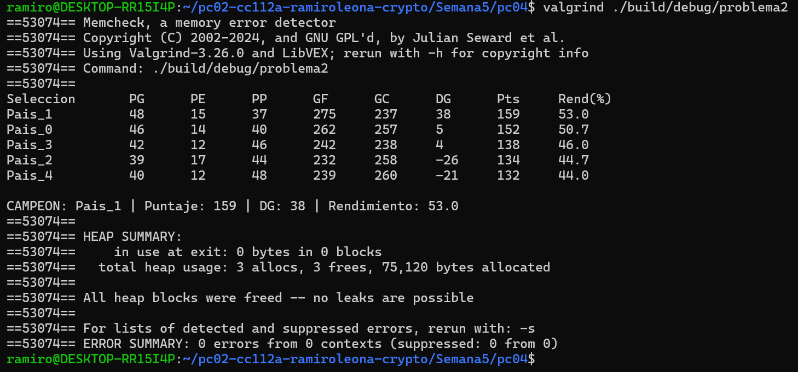
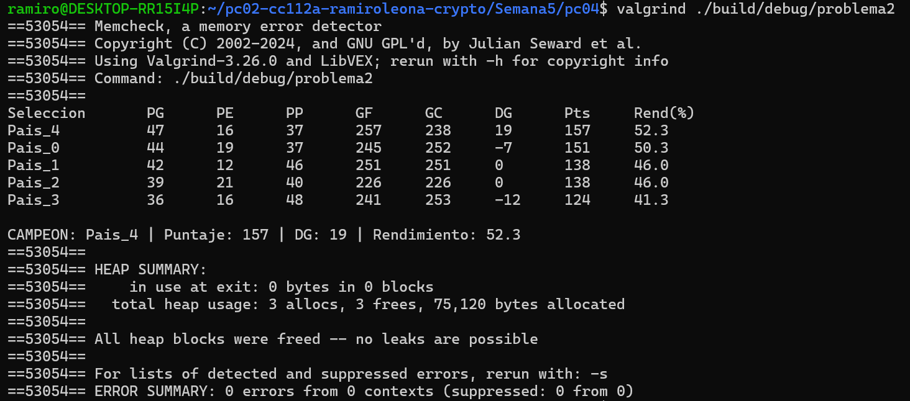
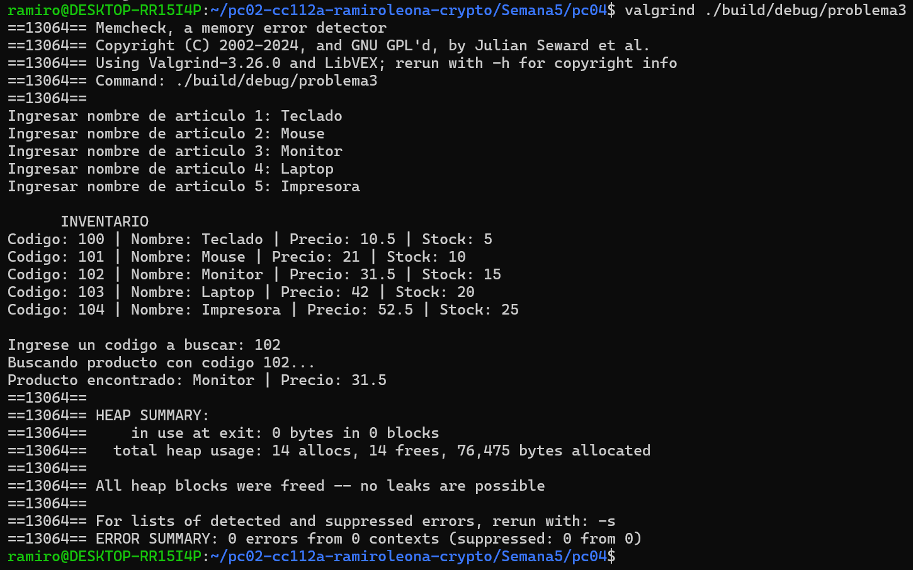
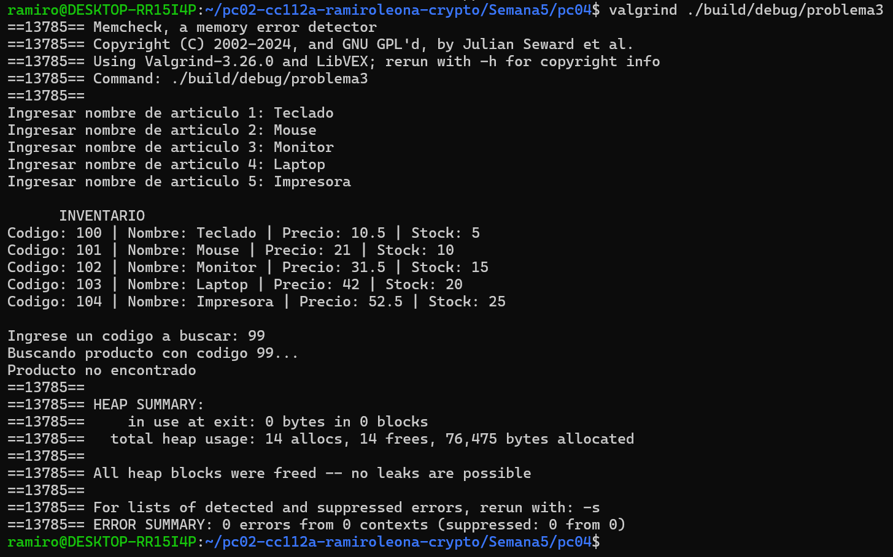
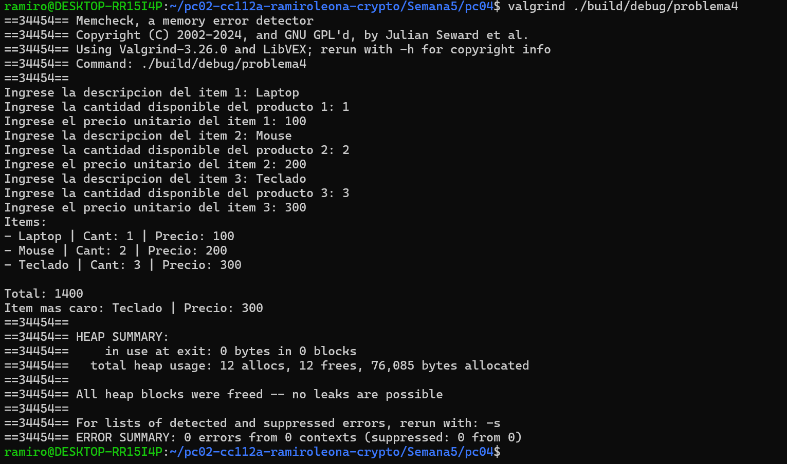

Problema 1:
    Salida 1
    
    Salida 2
    

Problema 2:
    Salida 1
    
    Salida 2
    

Problema 3:
    Salida 1
    
    Salida 2
    

Problema 4:
    Salida 1
    
    Salida 2
    